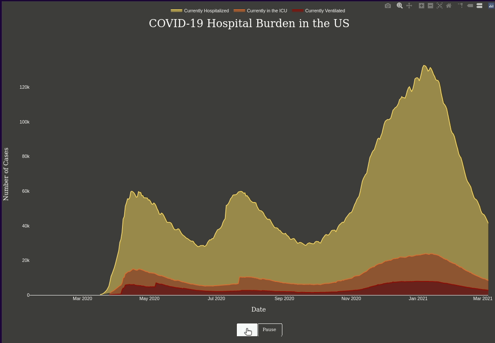
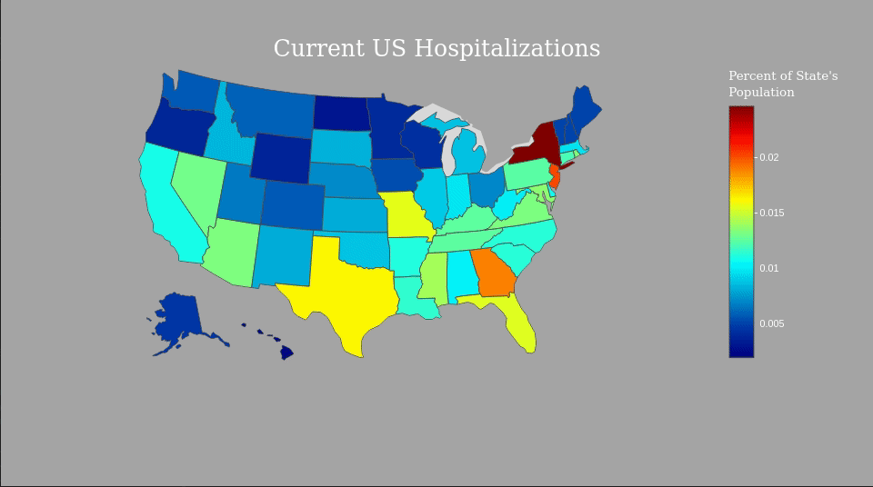

# Visualizing COVID-19 Statistics

This project creates visualizations for a few current COVID-19 related statistics in the USA using data from The COVID Tracking Project. As of March 7, 2021, The COVID Tracking Project is no longer collecting new data, so that will be the latest information available in the current iteration of this project.

* Animated Line Chart - Line chart visualizing the USA's Current Hospital Burden, showing the relationship between the total number of individuals hospitalized, those in the ICU, and those on a ventilator.

* Choropleth - Heatmap of Current US Hospitalizations presented as a percentage of the state's total population.

## Motivation

As the COVID-19 epidemic continues to spread around the world, the responses of international governments vary wildly. Here in the US, it is not uncommon to hear stories of overburdened healthcare facilities, overworked practitioners, and infections rising. As a public health professional, I was curious about what the data could tell us, so I took the opportunity to advance my visualization skills and made a project out of it.

## Screenshots

## Tools and Libraries

* Plotly.js
* Moment.js
* d3.js

## Features

* Interactivity - Both figures have interactive labels and the animation has an interactive legend toggle.

* Responsivity - Both figures are responsive to window size to an extent. When placed in responsive layouts, they can be set to follow the constraints of the container.

## Plans and Roadmap

Though I will not be prioritizing this project, I do have plans to come back to it over time. Potential updates include:

* Add light and dark mode
* Add color palette selector
* Refined and smoothed animation
  * This includes an update to the Y-axis range, since the data can now be considered static
  * I may alter the data source to CSV for the same reason.
* Add an index.html template that provides optimal display configuration and responsivity options
* Build additional visualizations
* Refactor with encapsulation - These charts were initially built to reflect the specific criteria of a project website and has not been fully transitioned as a solo project.

## Credits

* <a href='https://covidtracking.com/'>The COVID Tracking Project</a> - Created to address the shortcomings of an overwhelmed system, The COVID Tracking Project provided API or CSV access to  national and state raw data. While there are some difficulties with standardization and reliability, it is one of the most accessible sources of raw data. As of March 7, 2021, The COVID Tracking Project is no longer collecting new data.

* To view the original context for these visualizations, please visit <a href="https://github.com/FranciscoSerrano/Final-Project">Francisco Serrano's Final Project repository</a>
